# Week 1 - Getting Started

## Treehouse courses due this week
- [Introducing the VS Code Text Editors](https://teamtreehouse.com/library/introducing-the-vs-code-text-editor)
- [CSS Layout Basics](https://teamtreehouse.com/library/css-layout-basics)
- [Introduction to the Terminal](https://teamtreehouse.com/library/introduction-to-the-terminal)

## Treehouse courses due by next class
- [Introduction to Git](https://teamtreehouse.com/library/introduction-to-git)
- [GitHub Basics](https://teamtreehouse.com/library/github-basics)

This guide will step you through some good basics to know for FEWD. For the first week, we will start with the basics of getting the software you need. Then we will cover some basics of folder management, terminal usage, and file creation.

## Download locations for Recommended Software
- **[Visual Studio Code aka VS Code](https://code.visualstudio.com/):**
    - Visual Studio Code is an IDE, or Integrated Development Environment. This basically means it is a fancy text editor meant to help you better work with files relating to programming.
    - The version for your OS should automatically display on the download button, but you can click the downward-pointing arrow next to the download button to select a different version if needed.
    - If you select a different version, make sure to select the link under the *Stable* column, and not the *Insider* column.

        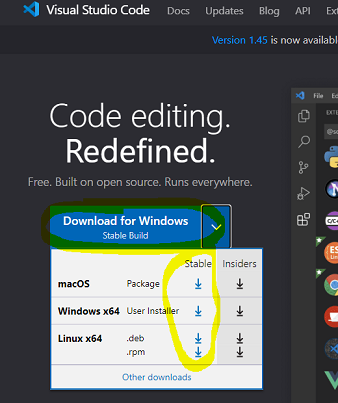

- **[NotePad++](https://notepad-plus-plus.org/downloads/):** 
    - Select the version listed at the top on this page.

    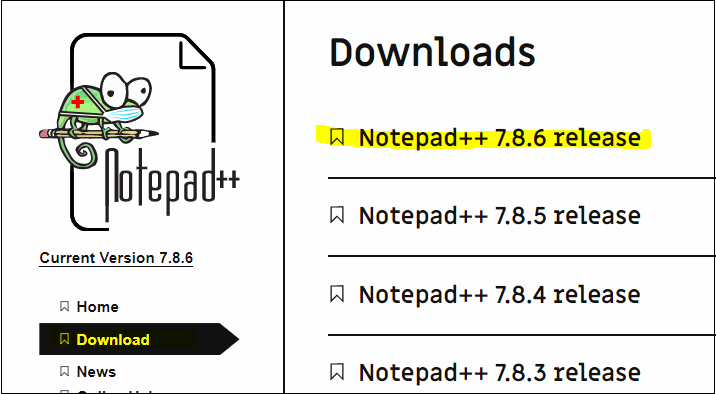

- **[Git for Windows](https://gitforwindows.org/):** 
    - This is just for Windows Users. Mac OSX has *Terminal*, which can already handle Git commands.
    - Git for Windows provides you with a nice Bash terminal for easier use of Git commands outside Visual Studio Code (VS Code).
    
    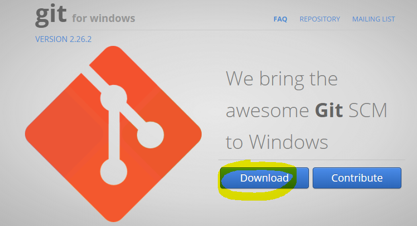

**Important Notes** </br>
For all of these downloads, just click Next until you can click Finish on the installs. Don't worry about selecting any special settings.

Windows may pop up asking you to approve the install. They should display the program's icon and/or name. You can click **Yes** on these.

## Create your first local repo folder
The following instructions will be directed at Windows users. However, if you have a Mac, one of the mentors can help.
1. Install the programs listed above first, and restart if requested.
2. Next make a folder on your desktop named **May 2020 FEWD**.
   1. Right-click on your desktop.
   2. From the menu that appears, select **New** and then **Folder**.
   3. When the folder appears, the name should be highlighted. Type the new name **May 2020 FEWD**, and then press the **Enter** button on your keyboard.
   
   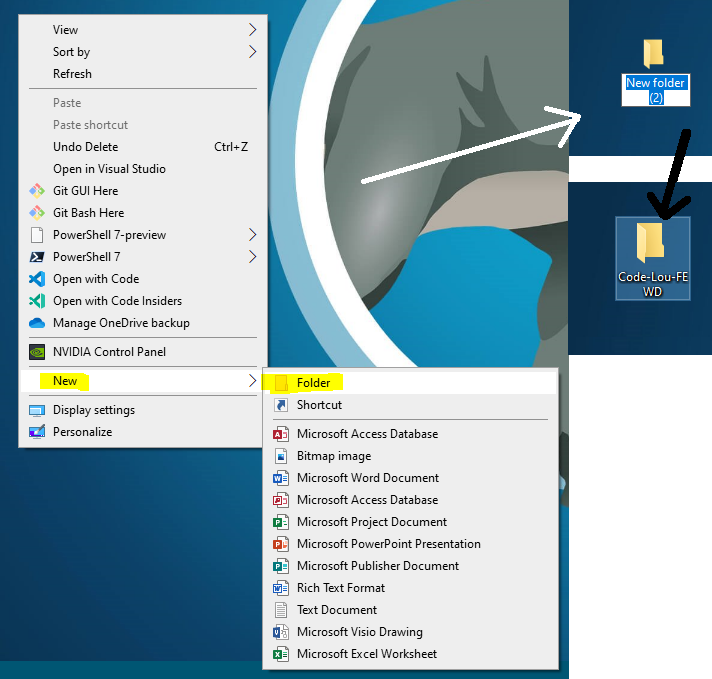
   
## Navigating to the folder in a Terminal
You have 2 ways you can proceed past this point. The longer way would be to open a terminal window, Git for Windows, and then navigate to the folder manually using various commands. 

Due to this being the first class, we will cover the easy method just to get you started. However, it is a REALLY good idea to get somewhat familiar with Terminal because it can save your butt when you get on the job. 

Make sure to pay good attention to the [Introudction to the Terminal](https://teamtreehouse.com/library/introduction-to-the-terminal) course on Treehouse that is included in the FEWD track this session, and the additional Git videos due for the 2nd class.

1. Go to your desktop and open the **May 2020 FEWD** folder you created.
2. Currently the folder is empty, right-click the blank white space in the middle of the folder window, and select *Git Bash Here*.
   
   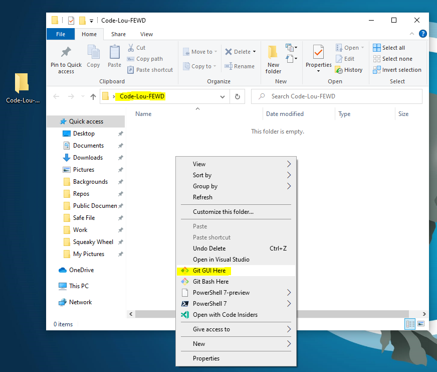

3. A **Git** window will open, and you will notice a couple of things about it if you opened it correctly.
   1. There will be a dollar sign that indicates a new line for you to type commands on.
   2. The line above that will display some information about your computer with the file path located at the end. If opened correctly, your folder's name should display at the end.

 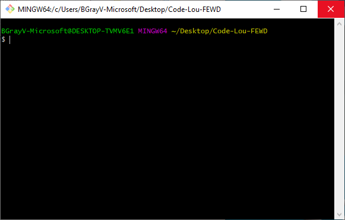

This means that commands you run will affect that folder unless you add arguments to change the target folder.

## Add a file to your new folder
Let's add a file to our future repo folder.
1. Open **Visual Studio Code (VS Code)** by opening the **Start Menu** and searching for it by typing **Code**. Then select **Visual Studio Code** when it comes up in the results.
2. Once you have VS Code open, we need to open your new repo folder. To do this, you can:
   1. Click the **Open folder** link on the **Welcome** window that first appears.
   2. **Or alternatively,** click **File** and then **Open** from the menu along the top of the window.

 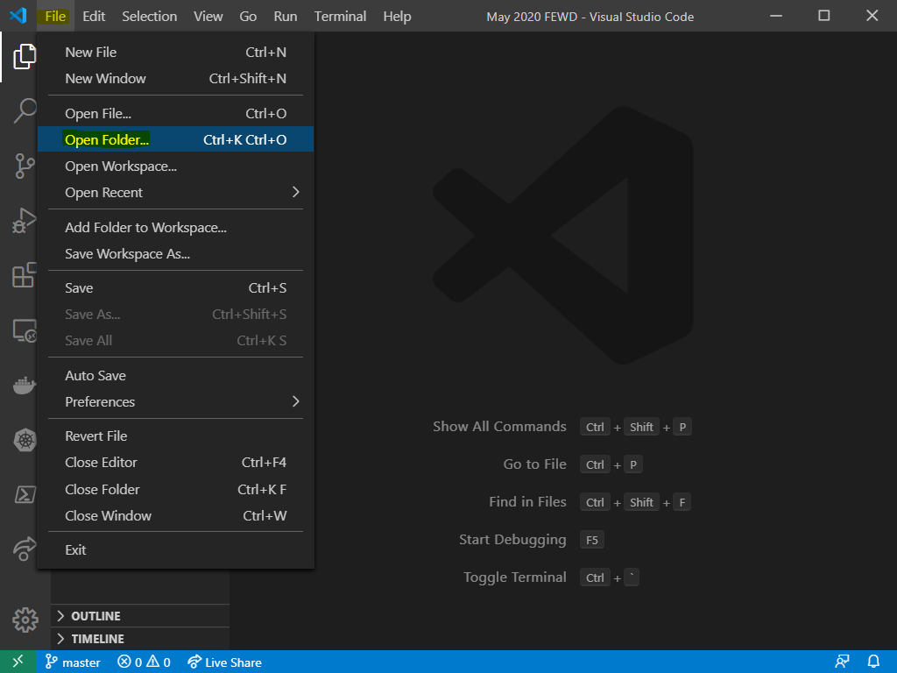

3. An **Open folder** window will appear. From here, you will need to navigate to inside the repo folder. Then click the **Select folder** button.

 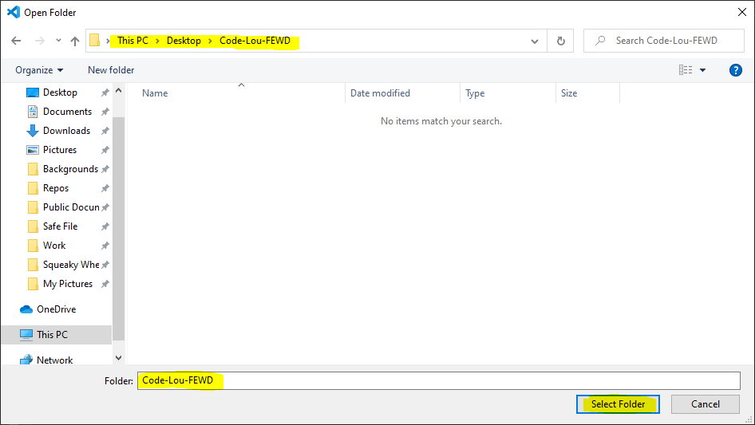

4. Close the **Welcome** tab if it is still open. You don't need it anymore.
5. In the VS Code window, you will now see the name of the folder in a column on the left-hand side. There will be nothing under the name since there are no files in the folder yet.
6. Hover over the folder name in VS Code, and some icons will appear.
7. From there, click the icon that looks like a page with a + symbol on it. You should see a message that says *New file* when you hover over it.
8. This will create a new file with no name. Type **index.html** for the name and them press the **Enter** key on your keyboard, or click elsewhere in VS Code.
9. You have now created your first file in your future repo.

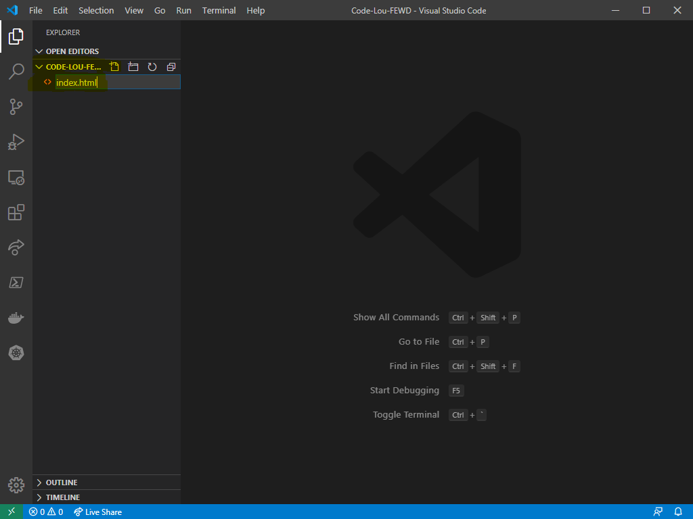

## Making your first html page
Now we are going to create our first viewable web page.
1. In VS Code, double-click the **index.html** file to open it.
2. Paste in the text below and then save the file using **ctrl + s** on your keyboard, or by clicking **File** and then **Save** from the top menu bar.
```html
    <!DOCTYPE html>
    <html lang="en">
        <head>
            <meta charset="UTF-8">
            <meta name="viewport" content="width=device-width, initial-scale=1.0">
            <title>Document</title>
        </head>
        <body>
            <h1>Hello World. I'm part of Code Louisville! Congrats on starting your programming journey!</h1>
        </body>
    </html>
```
1. Right-click on your **index.html** file in VS Code and select **Reveal in File Explorer**.

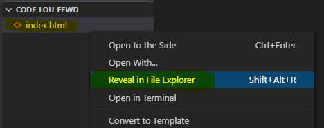

2. This will open the folder and allow you to double-click the file there to open it in a browser. If successful, it should look something like the screenshot below.

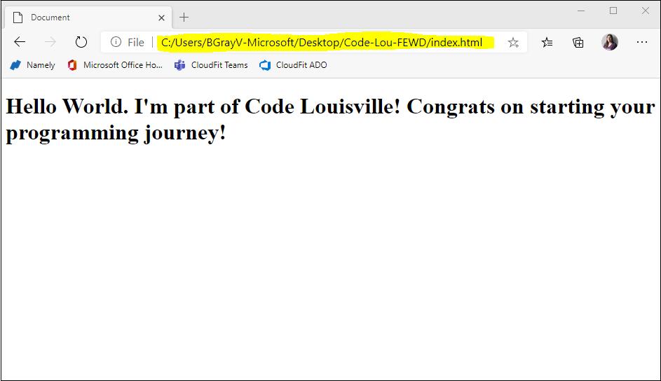

## The more you know
The `lang` attribute within the `html` tag has a special benefit for Accessibility. The lang attribute can affect how a screen reader pronounces some words, which can impact how well a user comprehends your site. It can also impact translation programs to some degree. 

The `lang` attribute in your `html` tag, should be representative of the primary language of your page. If you have parts of a page that differ from the one in your `html` tag, you can set a different `lang` attribute on other kinds of tags. Check out the W3C article on *[Declaring language in HTML](https://www.w3.org/International/questions/qa-html-language-declarations)* if you are interested in learning more.

**Congrats on learning so much during your first week!** Keep it up, and don't be afraid to reach out to mentors during class or in Slack if you need any assistance.