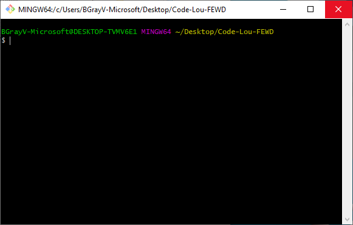

# Week 2 - Getting Started with Git

## Treehouse courses due this week
- [Introduction to Git](https://teamtreehouse.com/library/introduction-to-git)
- [GitHub Basics](https://teamtreehouse.com/library/github-basics)

## Treehouse courses due by next class
**IMPORTANT!!!** There is NO class Monday, May 25th due to Memorial day, but please don't skip your videos. Staying on track will help you have more time at the end to work on your project.
- [Debugging CSS with Chrome DevTools](https://teamtreehouse.com/library/debugging-css-with-chrome-devtools)
- [Responsive Layouts](https://teamtreehouse.com/library/responsive-layouts)
- [Practice Media Queries](https://teamtreehouse.com/library/practice-media-queries)
- [CSS Flexbox Layout](https://teamtreehouse.com/library/css-flexbox-layout)

This guide will step you through some good basics to know for FEWD. For the second week, we will start with some GitHub and Git basics. 

*Git* is a commonly used, open source *Version Control System* (VCS). 

*GitHub* is a web-based repo hosting service that uses *Git* at its heart. It takes Git and builds upon it with a web interface users can interact with in the browser and some of their own features.

## Creating a GitHub Account
1. Navigate to www.GitHub.com and click the **Sign up** link at the top of the page.
   1. *If you already have an account*, skip to the **Create your first GitHub Repo** section.
2. Fill in the details on the sign up form and submit it. 
   1. You will need to confirm your email address to get full use of GitHub's free features.

## Accessing the Terminal
There are 2 ways you will most likely interact with the terminal during this course:
1. Git for Windows - A separate Bash terminal program installed using the steps in the first week.
2. VS Code Terminal - Accessed within Visual Studio

### Git Bash
As mentioned previously, Git for Windows allows you to have a Bash terminal similar to running Powershell or Command Prompt on Windows. It is not necessary on Mac OSX as the Mac OSX already has a terminal. Also since Mac OSX is Unix based, it supports most Git commands natively.

**To open Git for Windows,** open the Windows Start Menu and type **Git**. You should see **Git Bash** come up as an Application you can open. Simply double-click it to open it.

### VS Code Terminal
VS Code has a built in terminal. To access it, select **Terminal** from the top menu bar in VS Code. Then select **New Terminal**.

Alternatively, you can press **ctrl + shift + \`**. That mark is a backtick mark ( ` ) and not a single quote ( ' ). It is typically found on the same key as the tilde ( ~ ), and is referred to as a **backtick** or a **backquote** due to how it is typically displayed as tilting to the left like a backslash ( \\ ).

#### Multiple Terminal Types
The main thing to remember in VS Code, is that it is not purely a Bash terminal the way Git for Windows is. It can be a PowerShell terminal, Command Prompt, Bash, and other terminal types. To confirm which kind it is currently, you can check the drop-down beside the new terminal window, shown in the screenshot below:


To switch to a different kind of terminal, you will need to:
1. Click the terminal selection drop-down menu.
2. Select the **Select default shell** option.
   
   

3. A menu will appear at the top of the VS Code window with a list of terminal types to choose from. Select the kind of terminal you need, in this case we need the select **Git Bash**.
   
   

4. Go back down to the Terminal and click the **New Terminal** button, indicated by a plus symbol ( + ).
5. You will then see the terminal update to display a terminal matching the type you selected. 
   1. **Important Note**: In VS Code, you will notice a number display beside the terminal type label. That is because VS code will open a new terminal, but not close the one that was open previously.
   2. You can select any of the open terminals, by clicking the drop-down menu where the terminal name displays.
   3. **To fully close** a particular terminal, you will need to make sure the drop-down displays the terminal you wish to close.
   4. Then click the **Kill terminal** button indicated by the trash can icon. All terminals will be terminated/closed when you fully close VS Code.
   
   

## Create your first GitHub Repo
1. Sign in to your GitHub account at www.github.com.
2. There will be a plus symbol in the upper, right-hand corner. Click it and select *New repository*.
3. The next window will be a form where you can set up your new repo.

   

   1. **Repository name**: Type a name for your repo. 
      1. You can change this later, but it can cause problems if you change it and then try to push to the repo with a folder linked originally to the old name.
   2. **Description**: Type a short description for your repo. This can be changed at any time with no issues.
   3. You will see the option for the repo to be **public** or **private**. Make sure that your repo you put your project in is set to public so that your mentors can view it to grade it. This can be changed later if needed.
   4. **DO NOT** check the box beside **Initialize this repository with a README**. 
      1. It is a good idea to have a ReadMe in every project you have.
      2. Don't worry about adding a ReadMe now though because it could cause problems when we go to push our local files up.
      3. You can add one later very easily.
4. Click **Create repository**. You now have your GitHub repo. The page for your GitHub repo will look something like this: 
   
   

## Set up your folder as a repo
If your repo already has files in it then you can just pull your repo and not do this step. However, it is still good to know how to do this.

1. Navigate to your folder in a terminal window. In this example, I am going to use the folder we created previously on the desktop.
   1. **Make sure you are inside the folder that you want to put your files inside as shown in the screenshot below. Otherwise you can end up adding way more than you mean to.**
   
   

2. Once you have confirmed that you are inside the appropriate folder, type `git init`.
   1. If you look inside the folder, your previously empty folder will now contain a little folder called **.git**. It is a hidden folder so you may need to turn on the option to view hidden items to see it.
   
   

3. Now you can type `git status`, and you should get something similar to the screenshot below. 
. 

4. The **index.html** file currently displays as an **Untracked file** because we have to tell the repo settings to track it as part of the repo.

## Add your folder contents to your repo
1. We can type `git add <fileName>` to add the file to the repo. This is often referred to as **staging** a change.
   1. If the filename contains spaces, put quotes("") around the file name.
   2. It is highly not recommended, but you can TECHNICALLY use `git add .` to stage all the contents in the folder. However, you can end up staging your whole C drive as part of your repo, which is why it is very important to make sure you are in the correct folder in your terminal before running commands.
2. Do `git status` again, and you will now see your **index.html** file listed as a *tracked* file.
. 

## Your first commit
Commits are very important. They act as save points you can roll back to if you need to. They can save you if you make a bad mistake and need to revert back to a point where you knew things were good.

They are especially important as you get into more complex projects, are working with others, or if you need to do a dreaded *cherry picking* of commits. You have the option of using the `-m` argument to add a message to your commit. Doing so it option, but leaving good commit messages will make you shine more to your colleagues.


1. . To add a commit, we need to use `git comit -m "<message>"` while we are in the repo folder in the terminal, and press enter.
   1. The portion in the quotes after `-m` can be whatever you want it to be, but should be a brief summary of what is changed. Preferably no more than 1 to 2 sentences in length.
2. Now we can connect our local repo to our GitHub repo location.

## Associating your local repo to a remote repo
A **remote** repository is something like GitHub. It is where you upload your files for safe keeping or sometimes for deployment.
A **local** repository is the copy of your repo that is located on your desktop.

**NOTE:** Make sure you have your GitHub username/password before you start this as they will be required.

When you create a folder on your desktop, and want to upload it to a remote repo, you must:

1. Set up the folder containing the files you want to upload using the `git init` command as described in the **Set up your folder as a repo** seciton.
2. Add any files with the `git add *<fileName>*` command as described in the **Add folder contents to your repo** section.
3. Commit those changes using the `git commit -m *"<message>"*` described in the **Your first commit** section.
4. For the next part we need to url for the GitHub repo. 
   1. There is no guarantee that this url is the same as the one in the web address bar for the repo.
   2. The safest way to make sure you get the right url, is to go to your repo's page in GitHub.
   3. Click the **Clone or download** button.
   4. Click the **clipboard** icon or manually highlight and copy the url provided.
   
   

5. Back in the terminal window that is displaying your repo folder, you will need to use the `git remote add origin *<GitHubURL>*` as shown in the screenshot below.
   
   

6. There are a couple of commands you can use to confirm you successfully added a remote.
   1. Run the `git remote` command again with no additional arguments afterwards. This will list `origin` if successful.
      1. It is not always labeled as `origin`, but this is generally what it will be called.
   2. Run the `git remote -v` command to list what url is set as the `fetch` url and the `push` url.
      1. These should generally be the same url.
7. You are now connected and ready to push your files to the repo.

## Pushing your local repo to your remote repo
Now it is finally time to add the files you worked on to your repo. This is generally referred to as **pushing** to a repo.

1. Back in the terminal window that is displaying your repo folder, run `git status` again just to verify that all the files in your repo folder is added/committed.
   
   

2. As long as your changes are added, you can then use the `git push <remote> <branch>` command as shown in the screenshot below. 
   1. Your `remote` will be the name you gave when you associated your local repo with your remote repo.
   2. By default, your main branch is often known as your `master` branch.
   
   

   3. Congrats!!! You now have a repo with files in. You can go to the GitHub page for your repo to see that you file is now uploaded. 
      1. You can also click on the **1 commit** link to view the commit we previously made.
   
      
      
      

## VS Code Shortcuts
You survived all of that. Now we are going to show you some shortcuts while adding a ReadMe file.

**Note**: It is still always a good idea to learn how to do things with terminal. Gaining a better understanding of terminal can make solving repo issues much easier on you in the future. There are many issues that do not have a GUI method to resolve them, so you can shine as a super star when you use your terminal-fu to solve them like a pro.

At the same time, don't get bogged down if you have trouble catching on. Even pros who have been developing for decades can struggle with some issues that require terminal to solve them. So don't think you have to be an expert by the end of this course. The important thing is to constantly work towards learning more.

### Creating a ReadMe
1. Create a new file in VS Code named *ReadMe.md* using the method described during Week 1.
   1. The *.md* on the file name indicates that this is a *Markdown* file.
   2. You can use HTML in a Markdown file, but not the same way as you would in a regular HTML file.
   3. **Instead**, you will use *Markdown* syntax.
   4. There are a variety of resources for how to write in Markdown, including some from GitHub. Take a moment to look at them.
      1. [GitHub Markdown Cheatsheet PDF file](https://guides.github.com/pdfs/markdown-cheatsheet-online.pdf)
      2. [Markdown Guide Cheatsheet](https://www.markdownguide.org/cheat-sheet/)
2. For this ReadMe, we are going to start simple, and then you can build it out to match your needs. The example below can be a great template for your FEWD project.
   ```
   # Project Title
   Description here.

   ## Features Included
   1. Feature 1
   2. Feature 2
   3. Feature 3

   ## How to Run the Project
   1. Open the root folder of the project.
   2. Open the index.html file in a web browser.
   ```
3. Save your file once you have pasted in the code and edited it how you want it.

### Staging/Committing inside VSCode
VS Code gives you multiple ways to identify untracked and unsaved files. 
- *Untracked files* in VS Code will:
  - have a capital letter U to the right of their file name in the file list if they have not been staged
  - have a blue circle with a number indicating how many files are untracked on the **Source Control** (looks like a split path) icon in the vertical, left-hand navigation bar
  - have their file name displayed in green in the file list
- *Unsaved files* in VS Code will:
  - have a white dot after the file name in the tab the file is open in, and next to their name in the **Open Editors** section
  - have a blue circle with a number indicating how many files are unsaved on the **Explorer** (looks like 2 pages stacked together) icon at the top of the vertical, left-hand navigation bar

You can see a side-by-side comparison in the screenshot below.


Saving the files can be done with the usual **ctrl + s**, or **File** and **Save**. Now how do you stage/commit the changes?

#### Staging Changes
1. **To stage these changes,** click that **Source Control** icon.
2. First stage the changes by either hovering your mouse over **Changes** or the individual file names listed under **Changes**. 
   1. This will cause a plus symbol to display.
   2. Hovering over the plus symbol should display a messaging saying *Stage All Changes* and *Stage Changes* respectively.
   3. The first one will commit all the changes listed. The second one will only commit the changes to the single file.
3. Upon staging a change, it will disappear from the **Changes** list, and be added to a **Staged Changes** list so you can track what you have / have not staged.


#### Committing Changes
1. **To commit your staged changes,** you will first want to type a message in the **Message** field above the **Staged Changes** list.
   1. You may get a yellow warning stating that you are *x characters over 50 in the current line*. It is okay to see this. It acts as a reminder that your messages should be short and simple. Also if you are committing a list of different changes, you can put each change on a different line. 
   2. For example, lets say I added the ReadMe and fixed a typo in the index.html file. In that case, I could type the following as my commit message:

      ```
      Added ReadMe file to repo.
      Fixed typo in index.html.
      ```
   Doing it this way would help keep my commit message clear, short, and organized. You don't need to go super, in-depth.
2. Next you can either:
   1. Click the inside the message field so your cursor is in there and press **ctrl + enter** on your keyboard to confirm the commit.
   2. Or you can click the **check mark** icon at the top of the **Source Control** column to confirm the commit.
3. Upon confirming the commit, all committed changes should disappear from the **Changes** list.
4. Next you can worry about pushing your changes to your **Remote** repo.


### Pushing your changes in VS Code
Now we finally get to psuh our changes to our remote repo! The Git integration with VS Code makes this step extremely easy. However, remember that by knowing terminal commands, you can more reasily resolve issues that occur when pushing and pulling to/from a Remote repo.

1. Make sure you are on the **Source Control** panel in VS Code where you previously committed your changes. 
2. At the top of the pane, you will notice a 3 dot icon (...), also known as an ellipses. CLick it to open a context menu.
3. Select the **Push** option.
   1. You may get a message that says *This branch 'master' has no upstream branch. Would you like to publish this branch?*, press **OK**.


4. You most likely won't see any messages in VS Code if everything was successful. However, you can navigate back to your Repo page and see the added files and the Commits listed.


## Additional Resources
- [Basic Git Commands Cheat Sheet by Atlassian](https://confluence.atlassian.com/bitbucketserver/basic-git-commands-776639767.html)
- [Free Code Camp - How to Discard Unstaged Changes in Git](https://www.freecodecamp.org/forum/t/how-to-discard-unstaged-changes-in-git/13214)