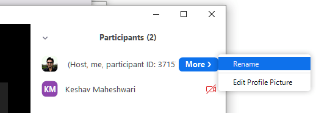
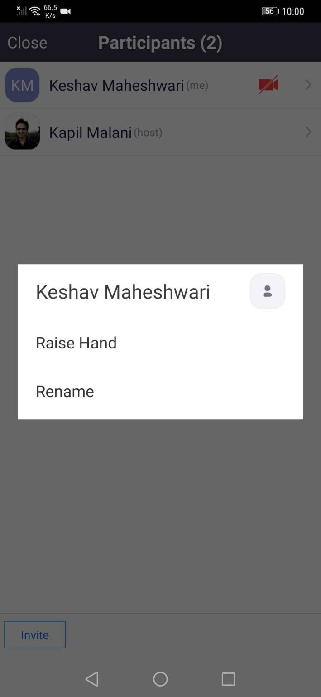
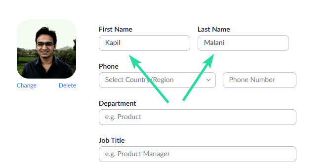

# Zoom
## Introduction
This page will include some tips to help with using Zoom.

## Download Links
Various Zoom download links can be found at the following link: [https://us04web.zoom.us/download#client_4meeting](https://us04web.zoom.us/download#client_4meeting).

## Zoom FAQs
### Navigation List
- [Desktop](#Desktop)
- [Mobile](#Mobile)

### Desktop
#### Change your name during a meeting
1. When in a meeting, click on **Participants** at the bottom of your screen in the calling bar.
    
2. Hover the mouse pointer above your name until you see the option to select **More**.
3. Once you see it, click on it and select **Rename**.
4. Enter your desired name in the text field and click on **Ok** to confirm your selection.
    

#### Change your name in your Zoom profile

### Mobile
#### Change your name during a meeting
1. During the meeting, tap on **Participants** to bring up the list of participants in your meeting.
2. Now find and select your name from the list and tap on it.
3. Select **Rename** and enter your desired new name in the text fields to change your name.
    

#### Change your name in your Zoom profile
This requires that you actually have a Zoom account.
1. Navigate to your [profile](https://us04web.zoom.us/profile?from=client) on Zoom's website.
2. Click **Edit** to the right of your profile picture.
3. Enter your desired name in the **First Name** and **Last Name** fields in the form that comes up.
    
4. Click **Save changes** at the bottom of the screen once you are done.

## Sources
- [Nerds Chalk - How to change your name on Zoom on PC and Phone](https://nerdschalk.com/how-to-change-your-name-on-zoom-on-pc-and-phone/)

